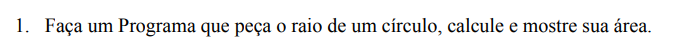
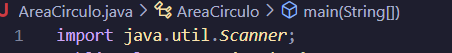
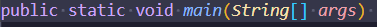
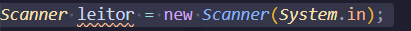
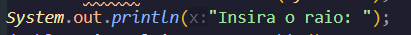
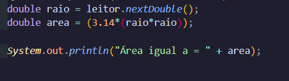

Primeiro desafio:

Diferente de algumas outras linguagens, o Java solicita a importação do objeto que irá receber um valor, então já iniciamos com 

Assim, poderemos importar o nosso *Scanner,* que precisa ser inicializado, mas para isso criamos a classe pública AreaCirculo, que, por sua vez, engloba a 

O public significa que o método main (Principal, em português) consegue ser acessado de qualquer lugar (Public = Público), o static remonta a ele pertenceer uma classe (Uma parte um pouco mais complexa), o void, que significa vazio, indica que não é retornado de fato nenhum valor, ou seja, toda aquela estrutura de código não produz nenhum resultado que precise ser utilizado posteriormente (Externamente!). O main, por último, remente a ser principal. O string[] args já é algo mais complexo de ser abordado no início, mas posteriormente fica interessante estudar matriz.

Então, continuando, inicializamos o Scanner (Quem vai ajudar a receber): 

O Scanner vai definir um objeto, como se Scanner fosse um tipo e leitor é o nome da variável. Então, ao invés de leitor, poderia ser qualquer nome. Recebedor, leitor, qualquer trem. O new Scanner vai inicializá-lo e o "System.in" dentro de parâmetros irá ativá-lo dentro do sistema. 

Quem já estudou Python, conhece o print. Quem conhece Portugol, conhece o escreva. Quem conhece Javascript, conhece o console.log. 

Agora quem conhece Java, conhece o System.out.print e pensa "Nossa, que textão". E sim. Java é verboso pacas.

Para ficar intuitivo, a mensagem é para inserir o raio do círculo. 

Aqui, já teremos os cálculos do código. Em double raio, definimos o tipo do raio para um número flutuante (Os tais números quebrados, com vírgula), colocamos o "=" para que ele receba o próximo valor, que é "leitor.nextDouble();". Dessa forma, fica parecendo que receberá um texto, mas não, não receberá. 

Chamando o objeto leitor (O Scanner!) e colocando .nextDouble(), ele define que estará recebendo o Próximo Número Flutuante que ele irá receber. Quando ele coloca ( ), significa que ele estará recebendo algum valor. 

Na outra linha, temos area (Também flutuante), recebendo o valor de pi * o quadrado do raio, que equivale a (raio * raio). Note que temos o uso de parênteses ali para garantir que seja respeitada a ordem dos cálculos. 

Por fim, temos mais um System.out.print para poder exibir o valor. Nesse caso, um System.out.println para que seja quebrada a linha e o valor não fique junto ao valor recebido. 

Ah, leve detalhe, todo fim de linha do Java precisa ser fechado com ;.
