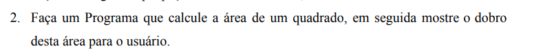

Agora, a segunda questão: 

A segunda questão segue a mesma lógica, só que nesse caso temos um diferencial: Ao invés de um nextDouble(), temos um nextInt(), ou seja, dessa vez ele irá receber o "próximo inteiro" escrito! Outro diferencial é ali, no area = area * 2. 

Nesse caso, estamos atualizando o valor para o valor * 2, como é uma leitura da esquerda para a direita, o valor consegue ser atualizado sem criar confusões ou loopings (Imagina se ele fica se atualizando o tempo todo sobre ser o mesmo valor * 2? Seria desastroso para o desempenho do meu i3.)

No final, System.out.print novamente para exibir a questão de valores.
