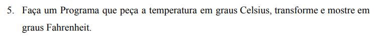
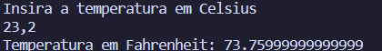
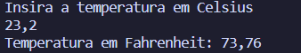

Não irei criar um para o Fahrenheit em Celsius, porque esse dará no mesmo. Após o System.out.print, já iremos receber o próximo valor flutuante para Celsius e um detalhe interessante: Ao invés de escrever 1,5, escrevemos 1.5. Esse valor será calculado posteriormente e, por meio do =, ele será recebido por fahrenheit, só que aqui também temos uma particularidade:

Importei um módulo novo. Ele se chama DecimalFormat, está no pacote de text justamente por ser uma questão de formatação. Por meio do DecimalFormat, criamos uma nova variável. Sim, variável. df Faz referência ao new DecimalFormat() e aqui também cai na regra, o parênteses significa que estará recebendo algum valor. 

Depois, temos a linha df.setMaximumFractionDigits(3), que definirá o máximo de dígitos para o número flutuante. Assim, não teremos um 

Mas sim, um: 

Mas óbvio, há alguns casos que números exatos são interessantes e outros que não. Para fazer algumas estipulações básicas, é ok, mas para a área financeira ou de construção, há a exigência de números completos. Um banco que arredondasse o seu 5.29 para 5.3 teria arredondado em várias outras contas: E de centavo em centavo, criaria um buraco financeiro na própria empresa. De outro lado, um banco que arredondasse de 5.29 para 5.28 estaria tirando dinheiro de forma indevida de seus clientes. 

Por isso, é sempre importante analisar o contexto do que está sendo pedido.
