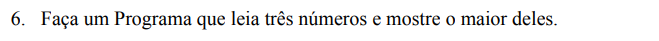
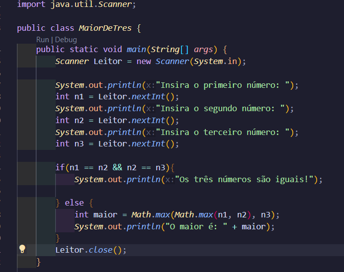

Esse é legal. O que é indicado para quem está na base do Java é: Faça condicional. Compare o primeiro valor com o segundo e com o terceiro, por exemplo: 

if (n1 > n2 && n1 > n3){

 int menor = n1;

} 

E mais algumas else if para complementar, para tratar no caso de n2 e n3 e um else, para qualquer invalidade. 

Porém, eu já conhecia a parte do Math., que me ajudou a agilizar MUITO esse processo: 

Nos primeiros System.out.println, informo sobre os valores que devem ser inseridos e, por meio das condicionais, confiro se os valores são iguais e, caso contrário, faço a variável inteira maior receber o valor máximo. Nessa parte vou detalhar um pouco mais. 

Temos dois Math.max, que parece um erro, mas tem um motivo: O math.max só recebe duas variáveis por vez, então o que fiz. 

Criei uma Math.max dentro dos parênteses, recebendo dois valores: n1 e n2. O objetivo do Math.max é extrair o maior valor, ele decidirá qual é o maior valor e externalizá-lo. Como resultado, o maior resultado será jogado para fora, mas ele também está dentro de um Math.max, só que agora sendo comparado ao valor de n3. Dessa forma, contam apenas dois valores nessa segunda parte também, mesmo que três variáveis tenham passado por ali. 

Caso não tenha ficado claro, vou dar um exemplo! 

**n1 = 4, n2 = 1, n3 = 3.** 

Math.max(n1, n2) -> Irá externalizar n1, já que n1 é o maior entre os dois, é o valor "Max" (Máximo em inglês).

Esse valor é carregado para o Math.max maior, então como ele "ganhou" a competição de maior, ele aparece no outro Math.max "competindo" com o n3. Como n3 é menor, n1 vence! Dessa forma, a variável inteira maior receberá n1, já que ele foi o que ganhou no meio de tantas condições. 

O system.out.print exibe ele no final e, depois disso, há algo que eu deveria ter feito: Fechar o Scanner, por meio do "Leitor.close()". 

Detalhe, o código poderia ser menor ainda utilizando operador ternário, mas isso é outro tópico.
