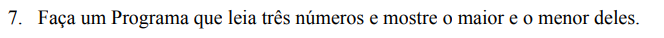
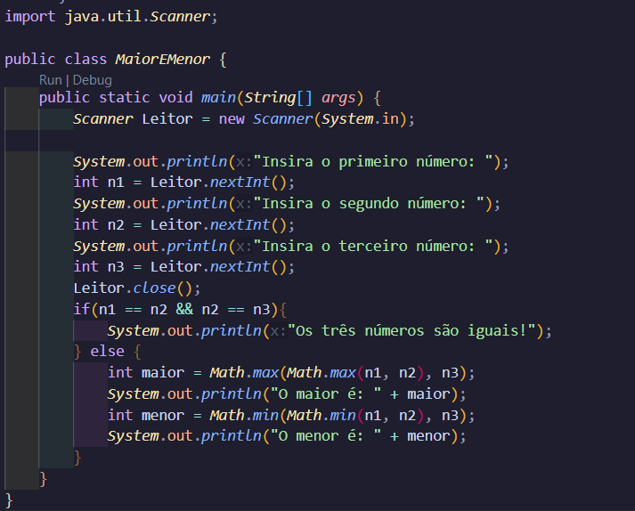

Novamente, vamos pular um pouco das condicionais. Ou não, tu que sabe. 

De forma contrária, temos o Math.min, que tem funcionamento completamente oposto ao Math.max. Dessa vez, ele mostrará o valor mínimo. E é isso. Não tem nada de muito diferente do exemplo anterior.
