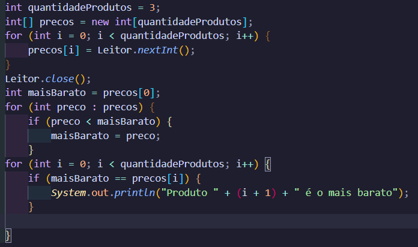

Esse exemplo foi o que mais chega próximo da minha vida. Estou liso. O mais importante da programação é utilizar os cálculos para resolver situações do dia-a-dia. 

A variável baratisse, por sua vez, recebeu o valor mínimo dentro dos produtos, mas é possível fazer de outra forma! 

Que aí é o ponto legal de programação também, evoluir para refinar o código e chegar em outro ponto, mas vai de cada um. Nesse ponto, se finca sobre a legibilidade, ou seja, o quanto o outro consegue entender de seu código.
