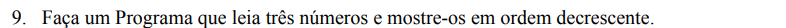
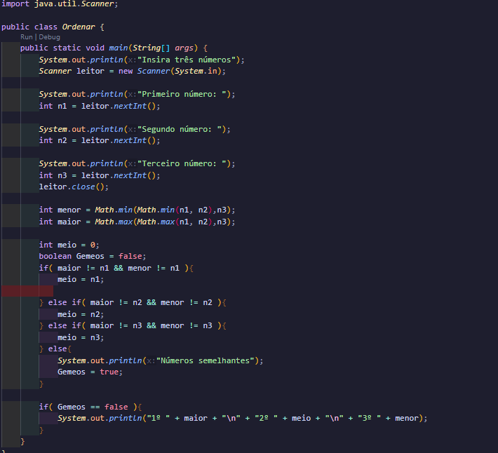

Esse é o mais complexo, pelo que eu vi.

Aqui, eu inicialmente pego o menor e o maior valor, que é a parte bem mais prática e rápida. Depois crio uma variável chamada de Gemeos, ela está no tipo "boolean". O boolean é interessante por causa que recebe valores; os valores disponíveis para uma variável booleana são "falso" (false) ou "verdade" (true). Outra coisa, nas condicionais, ao invés de simplesmente usar o ==, que faz a equivalência, utilizei o "!=". Enquanto o "==" significa igual, o "!=" significa diferente. Assim, os valores devem se diferenciar das variáveis ali, para que seja encontrado o valor do meio entre as três variáveis e seja confirmado que não há numeros iguais. No caso de ter alguma dupla de números iguais, há o "else" para tratar esse caso e definir que é verdadeiro que há números "Gêmeos". Assim, já fica impossibilitada a condicional abaixo, que mostra os números ordenados. Lembrando que "\n" serve para quebra de barra.++
