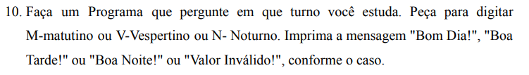
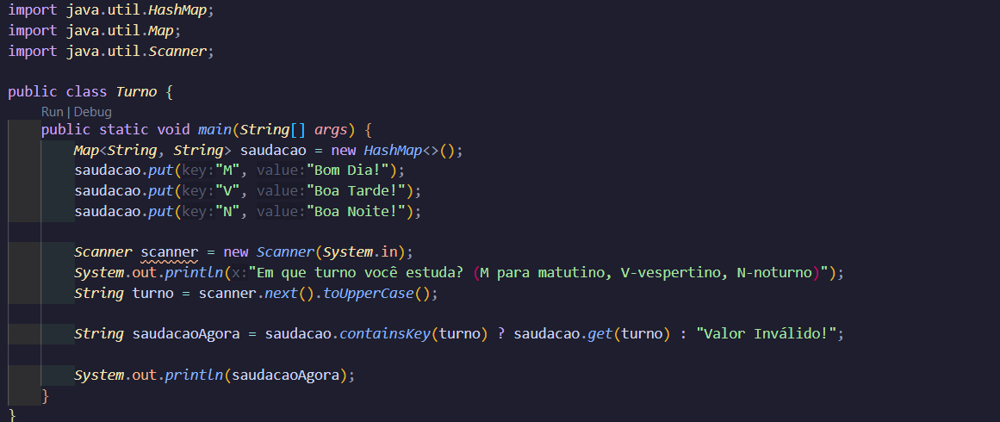
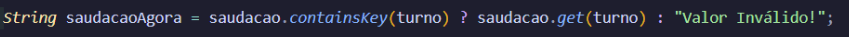
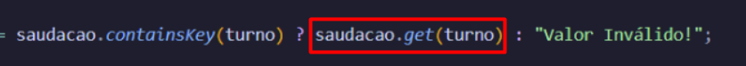

Quem estudou Python um pouco mais a fundo conhece dicionário e a parte "key-value". Quem não entende, de boa! É bem simples. Um dicionário basicamente carrega palavras. As palavras carregam significados, que normalmente são frases maiores.

Segue o código: 

Vamos lá, após as importações do que precisaremos usar, criamos o Map<String, String> saudacao. O que significa? 

O "String, String" significa que os dois valores inseridos dentro do nosso "dicionário" são valores de texto e esse dicionário se chama "saudacao". O .put, no caso, é como se estivéssemos escrevendo nos dicionários, inserindo a palavra chave "M", que significa "Matutino" e faz referência a um "Bom dia!".

Caso não tenha entendido, é simples: Se você procura a palavra flor no dicionário, encontrará, de acordo com o Google, "estrutura reprodutiva das angiospermas que, quando completa, é constituída por cálice, corola, androceu (estames) e gineceu (pistilos) e, quando incompleta, deve apresentar, no mínimo, um estame ou um pistilo.". Ou seja, uma palavrinha faz referência a todo esse significado. Inseridos valores, é chamado o Scanner e depois temos o Scanner.next();. O Scanner normalmente já pega texto, por isso não há necessidade de especificar um nextString(), mas chega em outra parte interessante: o .toUpperCase(). 

Basicamente, sabemos que "bus" e "BUS" significam a mesma coisa, mas para a linguagem Java, não. Ela é case-sensitive, ou seja, sensível a letras maiúsculas. O usuário é a maior variável dentro da programação, uma vez que não sabemos exatamente o que ele irá fazer. No máximo, podemos tratar seus erros, e por meio do .toUpperCase(), tornamos todo texto que ele receberá (m ou M), como maiúsculo, tratando todos "m/M" como "M". 

Por último, achei legal deixar um operador ternário.

É basicamente uma condicional, formada apenas por if e else que irá definir um valor para a variável de texto saudacaoAgora. Em saudacao.containsKey(turno), é recebido o valor que é inserido em turno e aí podemos fazer a seguinte analogia. 

Lembra que flor é uma palavra e aquela frase é seu significado?

Podemos definir que flor é uma key (chave) e o significado é o seu valor (Como palavra!). 

Dessa forma, o "saudacao.containsKey(turno)", vai para duas possibilidades: Ter e não ter esse valor. Caso ele tenha, ele irá para o primeiro código, que é 

Aqui, estaremos pegando o "significado" do valor que recebemos. Assim, pegamos a key (Palavra), inserimos ali e o .get irá puxar o seu significado (Que é o value, ou valor, em inglês.)! Caso não seja possível/Não tenha esse valor, ele irá pular para a segunda possibilidade, que é definir "Valor inválido" para a variável saudacaoAgora.
